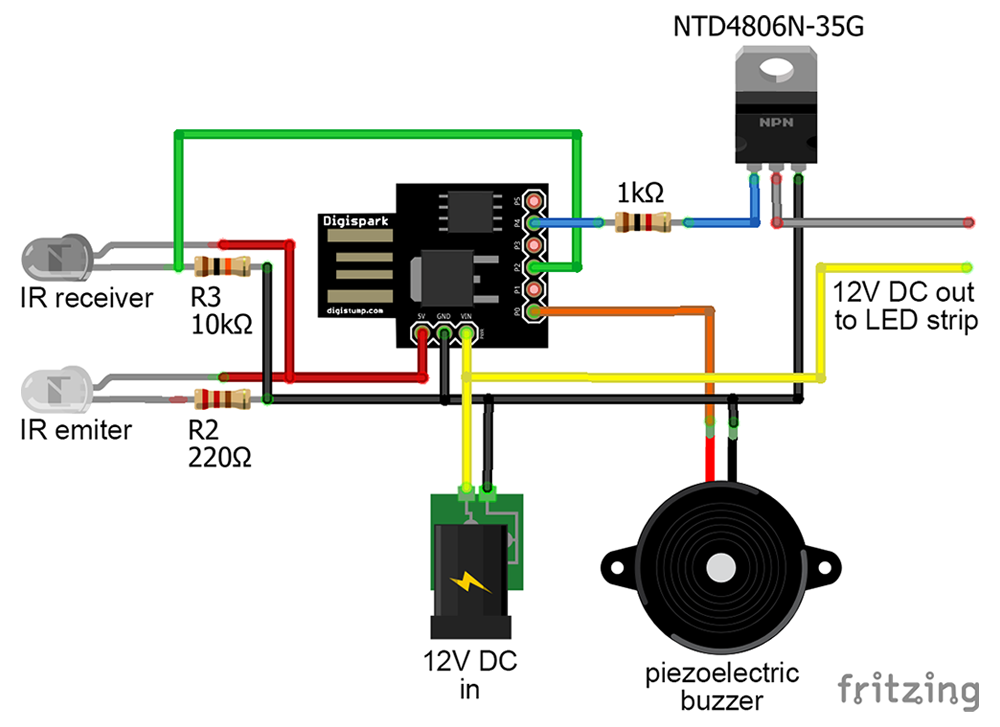

# Super Mario Interactive Light Cube

This is an interactive pendant light cube that you can interact with by bringing your hand close to the infrared sensors without the need to touch it.

https://user-images.githubusercontent.com/13419018/127786679-e069dc2d-2802-46c3-86b5-c9a163d7ce75.mp4

## ⚙ Interactions

* Interactions within 3 seconds will increase light intensity up to 7 levels and also reproduce the "coin" sound.
* Interactions after 3 seconds will turn off light and reproduce the "1-up" sound.

## 📝 Schematics

## 📑 Parts

* Digispark Attiny85 USB board.
* NTD4806N-35G N-Channel MOSFET Transistor.
* Passive piezoelectric buzzer.
* IR emiter.
* IR receiver.
* 1K ohm resistor.
* 10K ohm resistor.
* 220 ohm resistor.
* 12V LED strip.
* 12V power supply.

---

### Authors

* **Marcelo Pchevuzinske**: Laser cut, printed circuit board design and project execution.
* **Leonardo Sposina**: Electrical circuits design and code.

---

### References

* [Digistump Arduino](https://github.com/digistump/DigistumpArduino/)
* [Digispark Connecting](http://digistump.com/wiki/digispark/tutorials/connecting)
